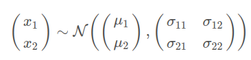
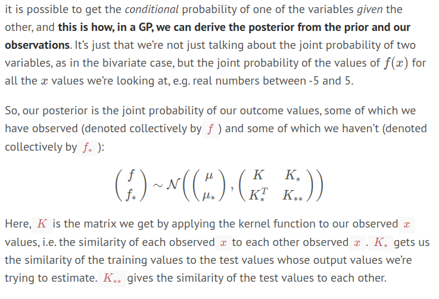

# probably the best explanation of how GPs actually work

(so you have some function that gives kernels that i assume we are sampling from that the bit im still a little confused about

Anyway imagine we have this:

then we could take a conditional probability of x2 given some value of x1 (and if the covar matrix for sigma12/sigma21 was non zero then the val of x1 would effect the val of x2)

This is basically just what is happening with the gaussian process as well. This explains it really well:

