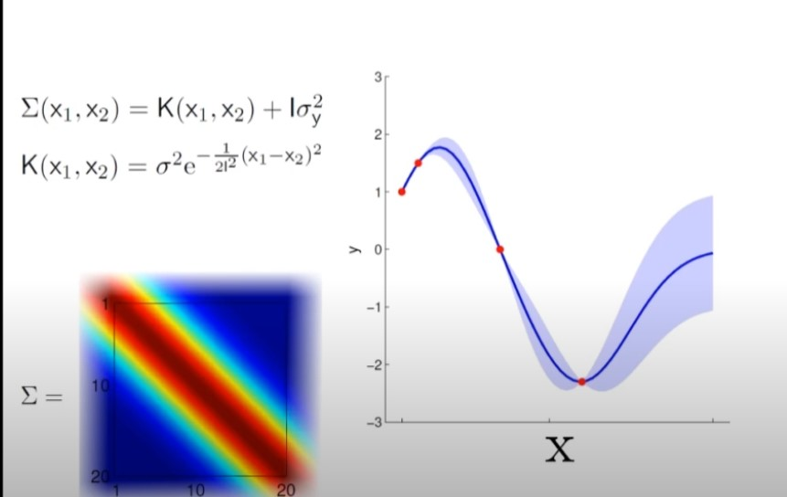

# probably the best explanation of how GPs actually work

(so you have some function that gives kernels that i assume we are sampling from that the bit im still a little confused about

Anyway imagine we have this:

then we could take a conditional probability of x2 given some value of x1 (and if the covar matrix for sigma12/sigma21 was non zero then the val of x1 would effect the val of x2)

This is basically just what is happening with the gaussian process as well. This explains it really well:

link to full post: https://katbailey.github.io/post/gaussian-processes-for-dummies/

# nvm

going off of this video now: https://www.youtube.com/watch?v=92-98SYOdlY&ab_channel=MarcDeisenroth

looking at what this guy is doing he deals with a set of discrete points inside of his covar matrix and conditions on the points he has
so his X matrix will have points without y values that we want to get the dist for, idk makes some sense i guess

and now he has just said he could make this continuous, why???? / how

getting to these equations:

interesting note about how sensitive to priors a bayesian optimisation? / hyperparam tuning would be to priors idk if this is important?

also a look at how the kernel function changes mean values you are getting

